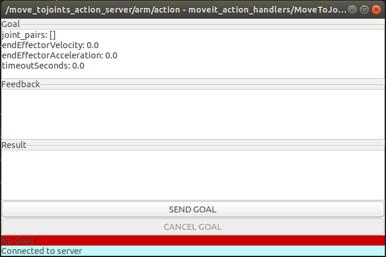

# MoveIt Action Servers

## Overview

This package holds the below custom action servers to interface with MoveIt 

- **Move to Joints Action server**
    - Receives goal targets in Joint Space 
- **Move to Pose Action Server**
    - Receives goal targets in Cartesian Space relative to a TF frame 

### Advantages

- They are easily modifiable to change the functionality
- Custom feedback
- Configuration files to launch multiple instances with different planning groups and action server topics
- Can be used as part of higher level behavior packages e.g
    - custom multi-client node / behavior node
    - FlexBe
    - Behavior trees

## Prerequisities

**A manipulator which is integrated with MoveIt e.g you can send random valid goals from the RViz plugin**

```bash
# install depedencies
rosdep install --from-paths src --ignore-src -r
```

## Configuration

On the config folder you can find the yaml parameter files used for the configuration of the action servers

#### Move to Joint Space - Arm

``` yaml
move_group: arm 
action_server_name: move_tojoints_action_server/arm/action
```

#### Move to Joint Space - Gripper

``` yaml
move_group: gripper
action_server_name: move_tojoints_action_server/gripper/action
```

#### Move to Cartesian Space - Arm

``` yaml
move_group: arm
action_server_name: move_topose_action_server/arm/action
base_link_name: arm_footprint 
ee_link_name: ee_base
```

### launch action servers

``` bash
# To start all 3 action servers

roslaunch moveit_action_handlers main_moveit_handlers.launch

# To Start 1 action server : (on the launch/include folder)

## Joint space arm 
roslaunch moveit_action_handlers move_joints_arm_action_server.launch

## Joint space gripper 
roslaunch moveit_action_handlers move_joints_gripper_action_server.launch

## Cartesian space arm 
roslaunch moveit_action_handlers move_topose_arm_action_server.launch
```

## action definitions

#### move to Joint space
```bash 
##Description: Moves robot arm to a specified joint space.

#goal definition
moveit_action_handlers/PropertyValuePair[] joint_pairs # list of joint_pairs (joint name + value)
float32 endEffectorVelocity
float32 endEffectorAcceleration
float32 timeoutSeconds #if this action cannot be completed within this time period it should be considered failed.
---
#result definition
bool success
uint64 millis_passed
string status  #Use the constants of ActionResultStatusConstants in the status field
---
#feedback
bool success
uint64 millis_passed
string status  #Use the constants of ActionFeedbackStatusConstants in the status field
```
#### joint pair value + name
```bash
##Usage: In MoveToJointsMoveIt.action

##Definition: A property name - Value definition.
string name
float64 value
```
#### move to Cartesian space
```bash
##Description: Moves robot arm to a specified pose relative to the frame in header.frame_id of target_pose
#goal definition

#Used to indicate which hardcoded motion constraint to use 
#e.g 0 no constraint, 1 keep the same end effector orientation
int32 constraint_mode
#similar to geometry_msgs/PoseStamped but using euler instead of quaternion
#at target_pose->header.frame_id define the tf frame 
# which the pose will be calculated relative from
moveit_action_handlers/PoseStamped target_pose

float32 endEffectorVelocity
float32 endEffectorAcceleration
float32 timeoutSeconds #if this action cannot be completed within this time period it should be considered failed.
---
#result definition
bool success
uint64 millis_passed
string status  #Use the constants of ActionResultStatusConstants in the status field
---
#feedback
bool success
uint64 millis_passed
string status  #Use the constants of ActionFeedbackStatusConstants in the status field

```
#### Feedback Constants
```bash
string PLANNING=Planning
string EXECUTING=Executing
string EMERGENCY_STOP=EmergencyStop
string OPERATIONAL_EXCEPTION=OperationalException
string CANCELLING=Cancelling
```
#### Result Constants
```bash
string SUCCESS=Success
string PLANNING_FAILED=PlanningFailed
string CONTROL_FAILED=ControlFailed
string EMERGENCY_STOP=EmergencyStop
string OPERATIONAL_EXCEPTION=OperationalException
string CANCELLED=Cancelled
```

## How to define and send goals to the Action Servers

### Demo client nodes

Demo client nodes that define action goals and send them to the servers have been developed both in python and c++ 
- python test clients
    - move_joints_arm_test_client.py
    - move_joints_gripper_test_client.py
    - move_topose_arm_test_client.py
- cpp test clients
    - move_joints_arm_test_client.cpp
    - move_joints_gripper_test_client.cpp
    - move_topose_arm_test_client.cpp

```bash
#e.g python (give permission with chmod +x if necessary)

# joints arm python client
rosrun moveit_action_handlers move_joints_arm_test_client.py
# joints gripper python client
rosrun moveit_action_handlers move_joints_gripper_test_client.py
# cartesian arm python client
rosrun moveit_action_handlers move_topose_arm_test_client.py

#e.g cpp

# joints arm cpp client
rosrun moveit_action_handlers move_joints_arm_test_client
# joints gripper cpp client
rosrun moveit_action_handlers move_joints_gripper_test_client
# cartesian arm cpp client
rosrun moveit_action_handlers move_topose_arm_test_client

```

### With actionlib's axclient gui

to easily send goals to action servers you can use the actionlib's GUI action client

```bash
# to start it
rosrun actionlib axclient.py /name of action server
#e.g
# joints arm
rosrun actionlib axclient.py /move_tojoints_action_server/arm/action
# joints gripper
rosrun actionlib axclient.py /move_tojoints_action_server/gripper/action
# cartesian arm
rosrun actionlib axclient.py /move_topose_action_server/arm/action
```

**a window will appear like this for each action server**



**you can fill the goal area like so**

#### Move Joint Arm Goal
```yaml
joint_pairs: [
    {name: shoulder_pan_joint, value: 0.0},
    {name: shoulder_lift_joint, value: 0.0},
    {name: elbow_joint, value: 1.5707},
    {name: wrist_1_joint, value: 0.0},
    {name: wrist_2_joint, value: 0.0},
    {name: wrist_3_joint, value: 0.0}
]
endEffectorVelocity: 0.1
endEffectorAcceleration: 0.1
timeoutSeconds: 10.0
```
#### Move Joint Gripper Goal
```yaml
joint_pairs: [
    {name: finger1_joint, value: 0.02},
    {name: finger2_joint, value: 0.02}
]
endEffectorVelocity: 0.1
endEffectorAcceleration: 0.1
timeoutSeconds: 10.0
```
#### Move Cartesian Arm Goal
```yaml
constraint_mode: 0
target_pose: {
    header: {
        frame_id: ee_base
    }, 
    pose: {
        position: {
            x: 0.03, 
            y: 0.0, 
            z: 0.03}, 
        orientation: {
            roll: 0.0, 
            pitch: 0.0, 
            yaw: 0.0}
        }    
}
endEffectorVelocity: 0.1
endEffectorAcceleration: 0.1
timeoutSeconds: 10.0
```

## Contact me

panagiotis.angelakis.robot@gmail.com

## Enjoy!